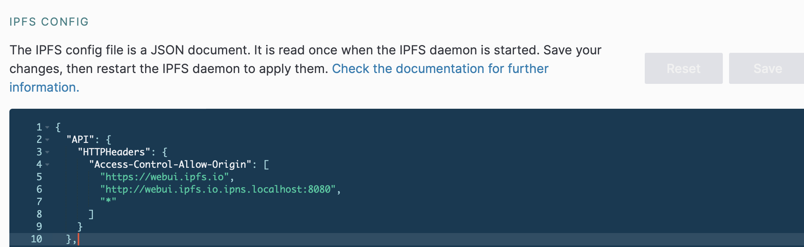
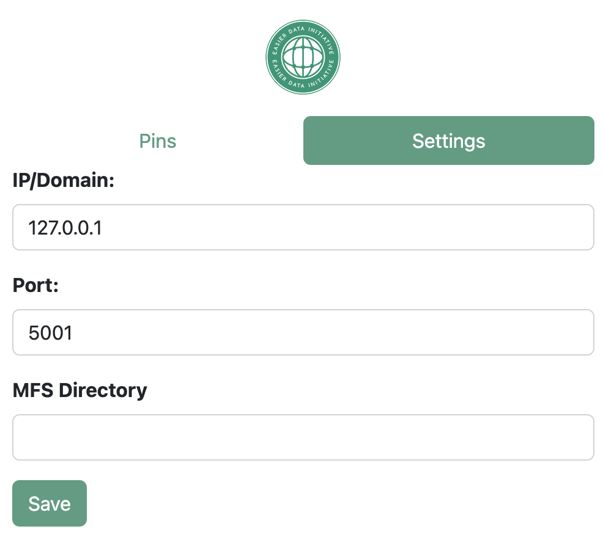

# EASIER Chrome Extension

This project complements the [Web3-Geo-Dashboard](https://github.com/easierdata/web3-geo-dashboard) and is used to enable pinning and other features.

## Setup

In your IPFS Daemon WebUI configure the IPFS Config to allow API requests by adding your project domain to the `API.HTTPHeaders.Access-Control-Allow-Origin` array in addition to the chrome extension (chrome-extension://`<id-goes-here>`). Alternatively, you can use an asterisk (`*`) to allow everything (I do not recommend this).

In `manifest.json` add permissions to access your project domain.

In your chrome extension settings, select `Load Unpacked` and navigate to this folder.

Upon first launch, select the settings tab in the popup and reference the following to get it set up.

## Settings

The following table highlights the values for each of the settings to be configured

|    Setting    | Required? |                                              Description                                              |
| :-----------: | :-------: | :---------------------------------------------------------------------------------------------------: |
|   IP/Domain   |   True   |                              The IP of the IPFS Node that supports Kubo                              |
|     Port     |   True   |                                 The port of the IPFS Kubo RPC service                                 |
| MFS Directory |   False   | The directory in the IPFS Node's mutable file system (MFS) to save files to. Example: /example_folder |
