## Execution order of Chrome Extension scripts

In a typical Chrome extension, the execution order of scripts is as follows:

* **background.js**: This script is loaded when the extension is installed or the browser is started. It runs in the background and listens for events, such as clicks on the extension's icon, inter-page communication, or external requests. It can interact with web pages by exchanging messages with content scripts.
* **contentScript.js**: This script is injected into the web pages that match the patterns specified in the matches field of the content_scripts section in the manifest.json file of the extension. It runs in the context of the web pages and can read or modify the DOM of the web pages. However, it cannot use most Chrome APIs directly. It needs to communicate with the background script to perform tasks that require Chrome APIs.
* **script.js**: This script is typically a part of the extension's popup or options page. It runs when the popup or options page is opened. It can use Chrome APIs and communicate with the background script.

Below is a sequence diagram that illustrates the communication between these scripts:

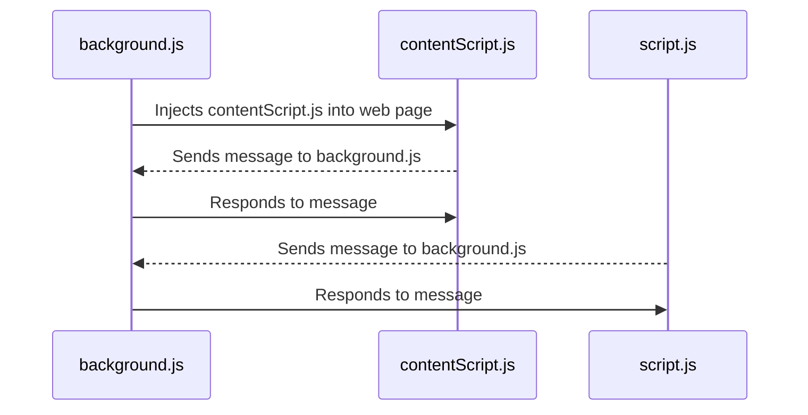

> Please note that the actual execution order and interaction between these scripts can vary depending on the specific implementation of the extension. The above sequence diagram provides a general overview of the communication flow between the background script, content script, and the script running in the extension's popup or options page.

In a Chrome extension, `script.js` (which is typically part of the extension's popup or options page) cannot directly call functions in `contentScript.js` (which is injected into web pages). They operate in different contexts: `script.js` runs in the extension context, while `contentScript.js` runs in the context of the web page.

However, they can communicate with each other using Chrome's message passing APIs. Here's a basic example:

In `contentScript.js`, you can listen for messages from `script.js`:

```javascript
chrome.runtime.onMessage.addListener(
  function(request, sender, sendResponse) {
    if (request.message === "callFunction") {
      myFunction();
      sendResponse({result: "Function called"});
    }
  }
);
```

In `script.js`, you can send a message to `contentScript.js`:

```javascript
chrome.tabs.query({active: true, currentWindow: true}, function(tabs) {
  chrome.tabs.sendMessage(tabs[0].id, {message: "callFunction"}, function(response) {
    console.log(response.result);
  });
});
```

In this example, when `script.js` sends a message with `{message: "callFunction"}`, `contentScript.js` receives this message, calls `myFunction()`, and sends a response back to `script.js`.

## Order of execution of functions in script.js on first load

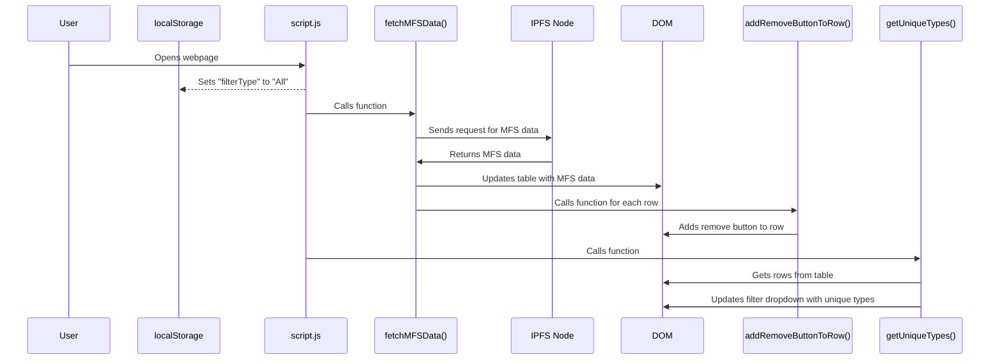

## Flowchart for REQUESTS

### Flowchart of REQUESTS made in each function of script.js

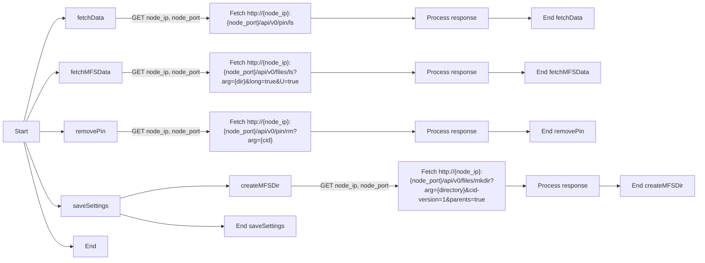

### Flowchart of REQUESTS made in each function of contentScript.js

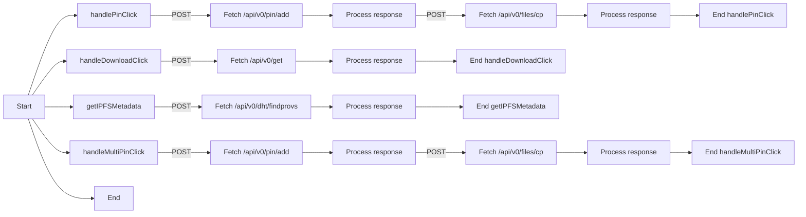

## Sequence Diagrams for functions in contentScript.js

### Sequence of the `handlePinClick` function that sends call to service worker to pin feature

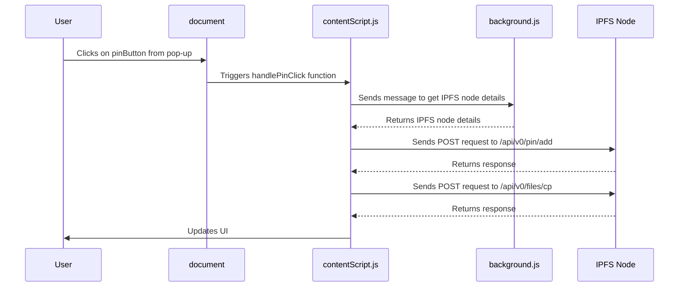

### Sequence of the `handleDownloadClick` function that sends call to service worker to download feature

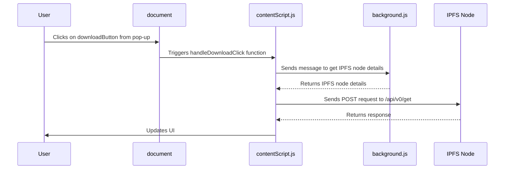

### Sequence of the `getIPFSMetadata` function that gets ipfs metadata if popup is displayed

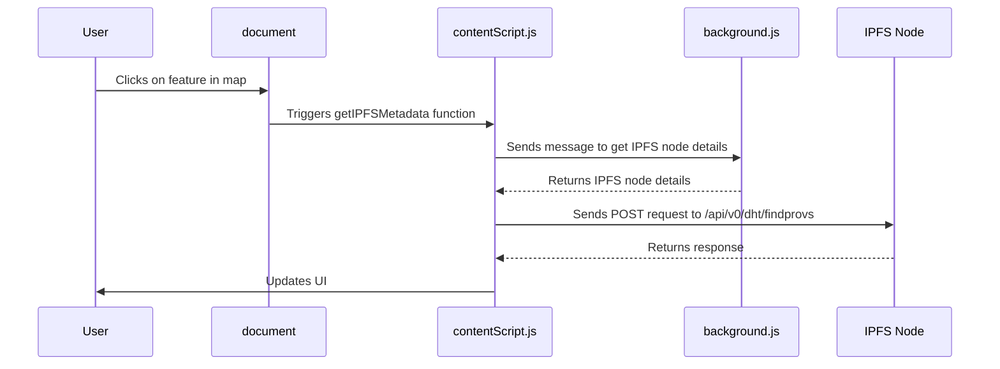

### Sequence of the `handleMultiPinClick` function when multiple features are selected

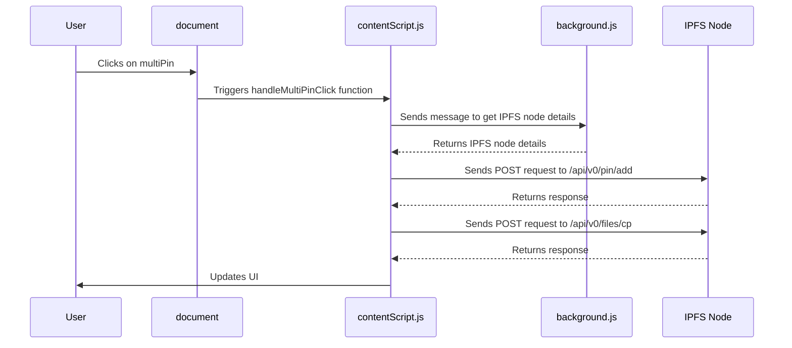

## Sequence Diagrams for functions in script.js

### Sequence of how the settings form is saved

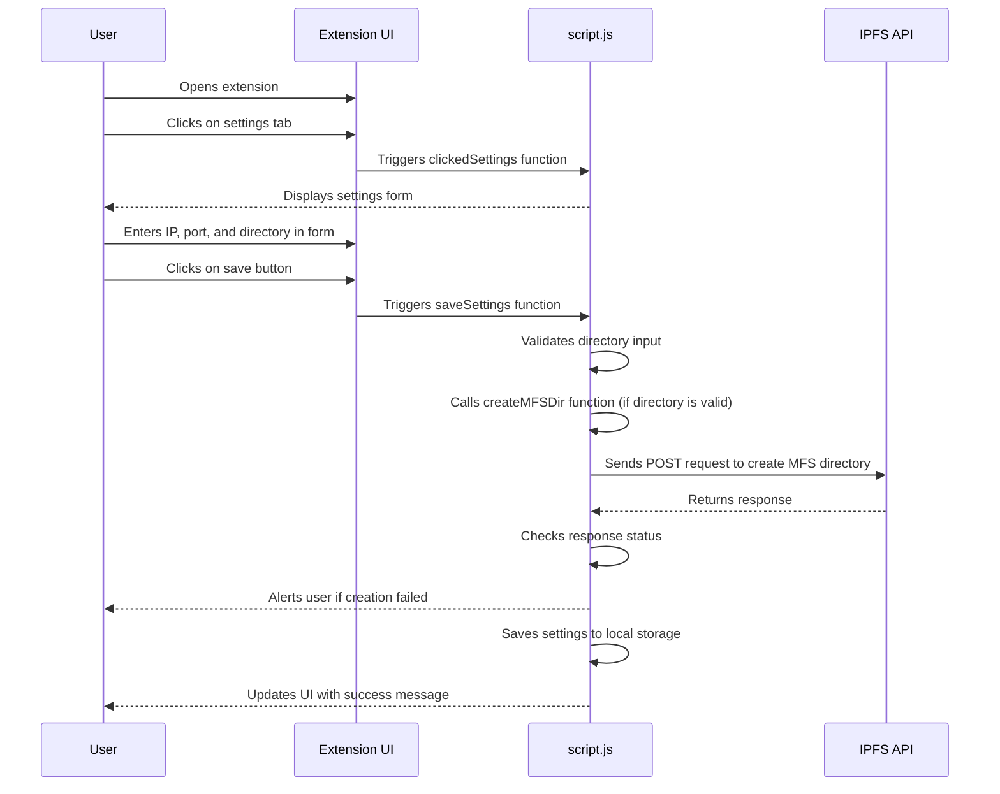

### Sequence of how the table is populated when a user clicks on the Pin tab or opens the extension

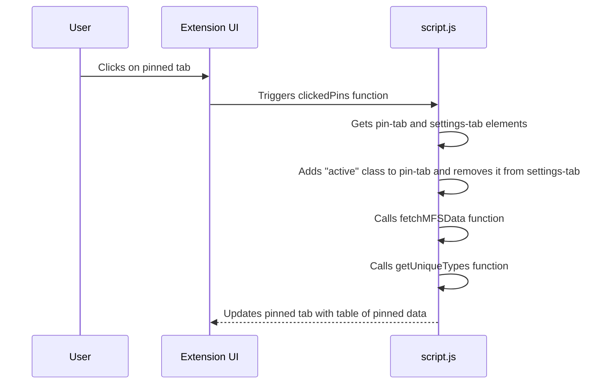

### Sequence of how a filter is applied to the table by the user

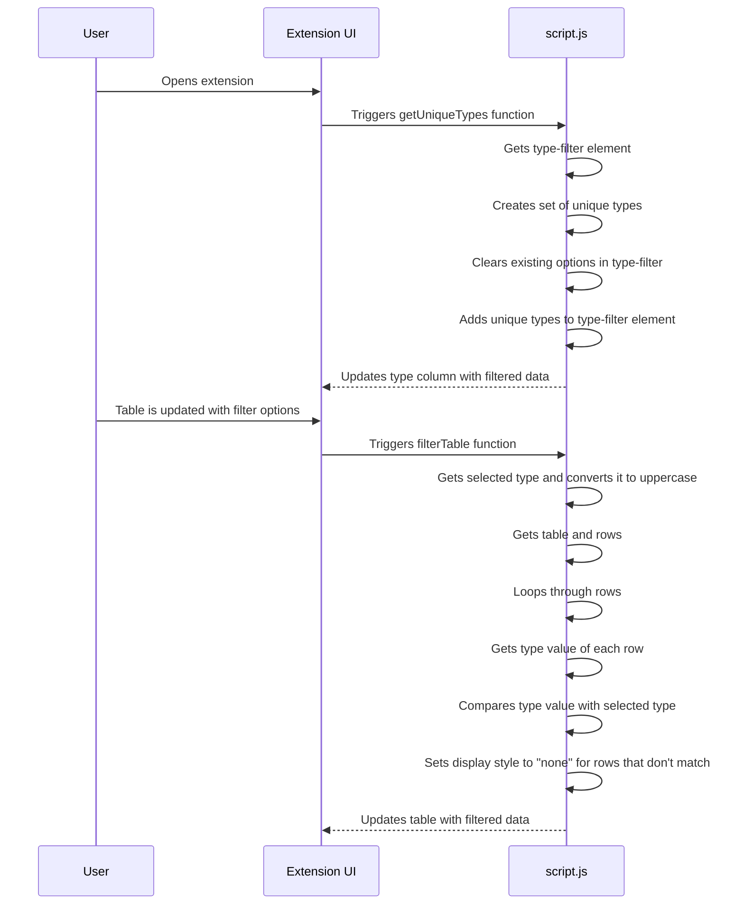

### Sequence of how the remove pin button is added to the table

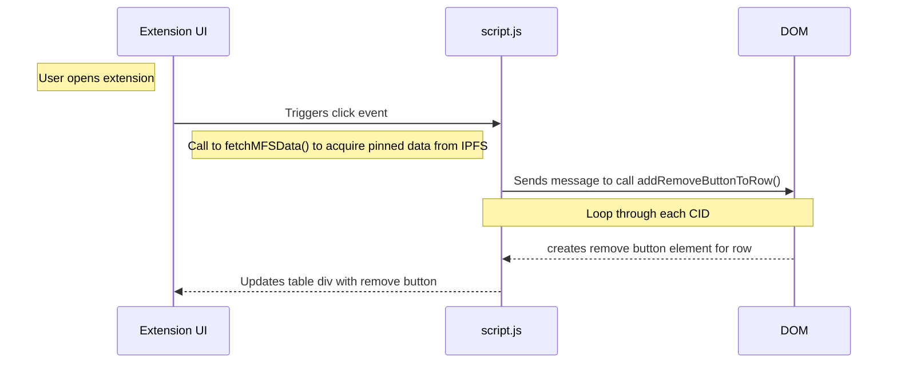

### Sequence of how a pin is removed from the table by the user

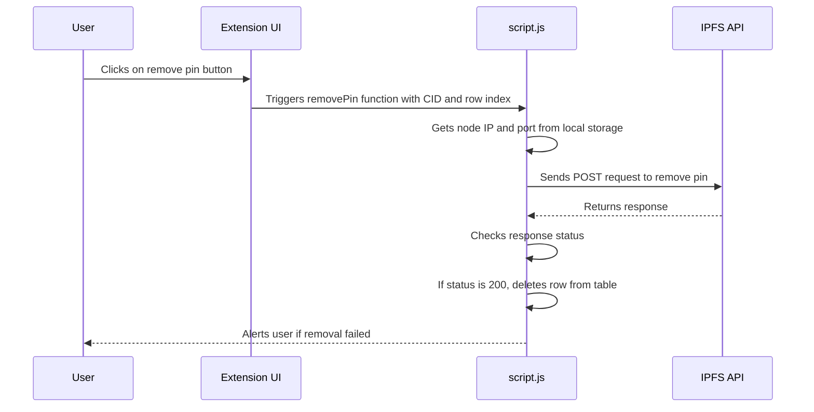
